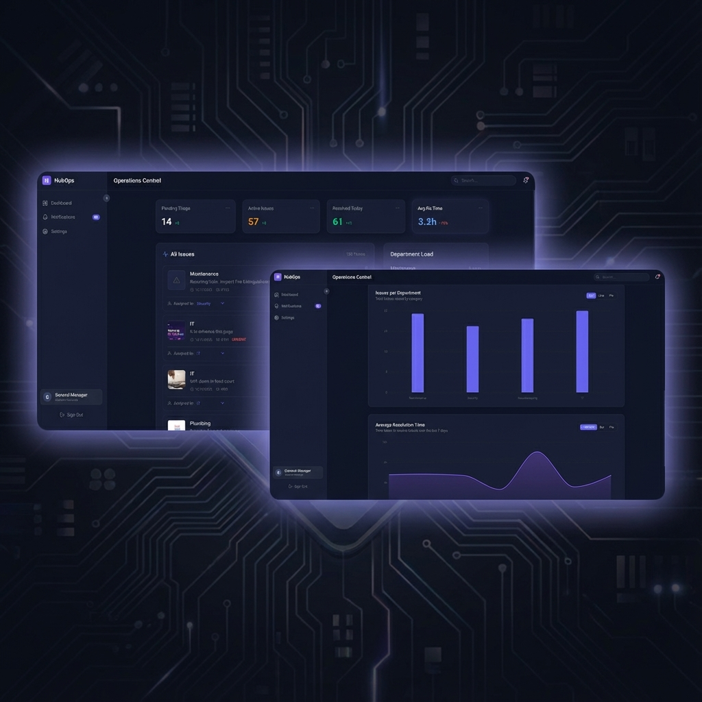

# 🏢 HubOps

> **Streamlining Operations for Premium Retail Environments**



<!-- *Note: You can replace the banner above with a genuine screenshot of the application.* -->

**HubOps** is a state-of-the-art **Tenant Management Platform** designed to optimize communication and workflows within large-scale retail environments like "The Hub Karen". It bridges the gap between Tenants, Operations Staff, Department Heads, and General Management through a unified, role-based interface.

Built with a focus on modern aesthetics and responsiveness, HubOps ensures that managing maintenance requests, tracking recurring tasks, and analyzing performance is seamless and intuitive.

---

## ✨ Key Features

### 🎫 Comprehensive Ticket Management

- **End-to-End Lifecycle**: Tenants can report issues with photos; Managers assign them; Staff resolves them with "Proof of Work" uploads.
- **Role-Specific Views**:
  - **Tenants**: Submit requests and track status.
  - **Departments**: View and assign tickets specific to their domain (Maintenance, IT, Security, Housekeeping).
  - **Staff**: Accept tasks and upload resolution evidence.
  - **General Manager**: Bird's-eye view of all operations.

### 🔄 Intelligent Scheduler

- **Recurring Tasks**: Automate the creation of routine maintenance tickets (e.g., "Weekly HVAC Check", "Daily Corridor Cleaning").
- **Smart Assignment**: Automatically routes recurring tasks to the appropriate department.

### 📊 Advanced Analytics Dashboard

- **Real-Time Insights**: Visual charts (powered by Recharts) for "Issues per Department", "Tenant Satisfaction", and "Average Time to Fix".
- **Department Load**: Monitor active tickets per department to prevent bottlenecks.

### 🎨 Premium UI/UX

- **Modern Tech Stack**: Built with React, Vite, and Tailwind CSS.
- **Glassmorphism Design**: Sleek, translucent interfaces for a modern feel.
- **Animations**: Smooth transitions using Framer Motion.

---

## 🛠️ Technology Stack

### Backend API

- **Language**: Python 3.10+
- **Framework**: [Flask](https://flask.palletsprojects.com/)
- **API Extension**: Flask-RESTful
- **Authentication**: JWT (Flask-JWT-Extended)
- **Database**: SQLite (Development) / SQLAlchemy ORM
- **Migrations**: Flask-Migrate

### Frontend Client

- **Framework**: [React](https://react.dev/) (Vite)
- **Styling**: [Tailwind CSS v4](https://tailwindcss.com/)
- **Icons**: Lucide React
- **Charts**: Recharts
- **State/Routing**: React Router DOM, Context API

---

## 🚀 Getting Started

Follow these instructions to set up the project locally for development.

### Prerequisites

- **Python** 3.10 or higher
- **Node.js** 18 or higher
- **npm** or **yarn**

### 1️⃣ Backend Setup

Navigate to the backend directory:

```bash
cd backend
```

Create a virtual environment:

```bash
python -m venv venv
source venv/bin/activate  # On Windows: venv\Scripts\activate
```

Install dependencies:

```bash
pip install -r requirements.txt
```

Initialize the database:

```bash
# Verify if migration is needed or just run the app (database creation is often handled in app.py or seed.py)
python seed.py  # Optional: Seeds the database with initial demo data
```

Run the server:

```bash
python app.py
```

> The API will start at `http://localhost:5000`

### 2️⃣ Frontend Setup

Navigate to the frontend directory:

```bash
cd frontend
```

Install dependencies:

```bash
npm install
```

Run the development server:

```bash
npm run dev
```

> The application will be available at `http://localhost:5173` (or the port shown in your terminal).

---

## 📖 Usage Guide

1. **Login**:
   - Use the **Demo Login** buttons on the login page to quickly switch between roles (Tenant, GM, Dept Head, Staff).
2. **Tenant Flow**:
   - Log in as **Tenant**.
   - Click "Report Issue", upload a photo, and submit.
3. **Manager Flow**:
   - Log in as **GM** or **Department Head**.
   - Review incoming tickets on the Dashboard.
   - Assign tickets to specific staff members.
4. **Resolution**:
   - Log in as **Staff**.
   - "Accept" a ticket.
   - Once done, click "Resolve" and provide a "Proof of Work" (image URL or upload).

---

## 👥 Contributing

Contributions are welcome! If you'd like to improve HubOps, please follow these steps:

1. **Fork** the repository.
2. **Create a Branch** for your feature (`git checkout -b feature/AmazingFeature`).
3. **Commit** your changes (`git commit -m 'Add some AmazingFeature'`).
4. **Push** to the branch (`git push origin feature/AmazingFeature`).
5. **Open a Pull Request**.

---

## 📄 License

Distributed under the MIT License. See `LICENSE` for more information.
